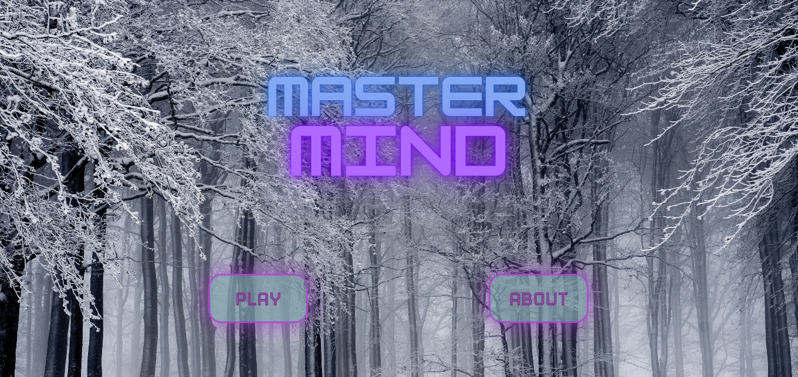
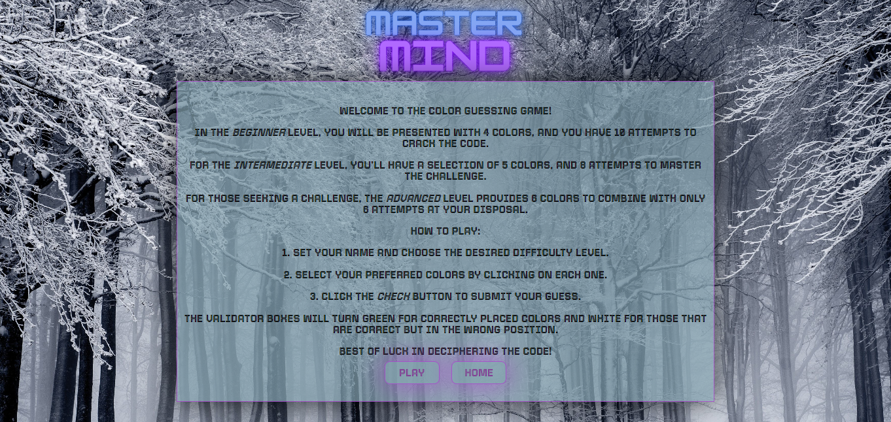
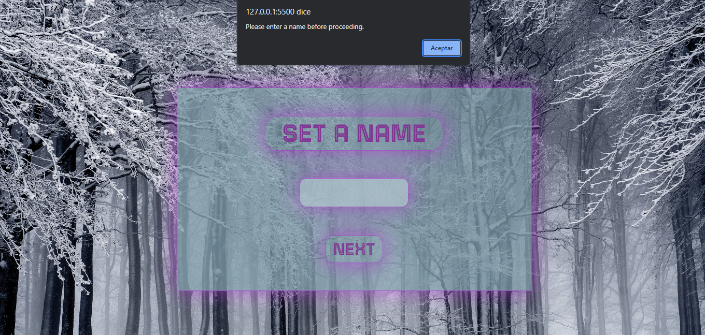
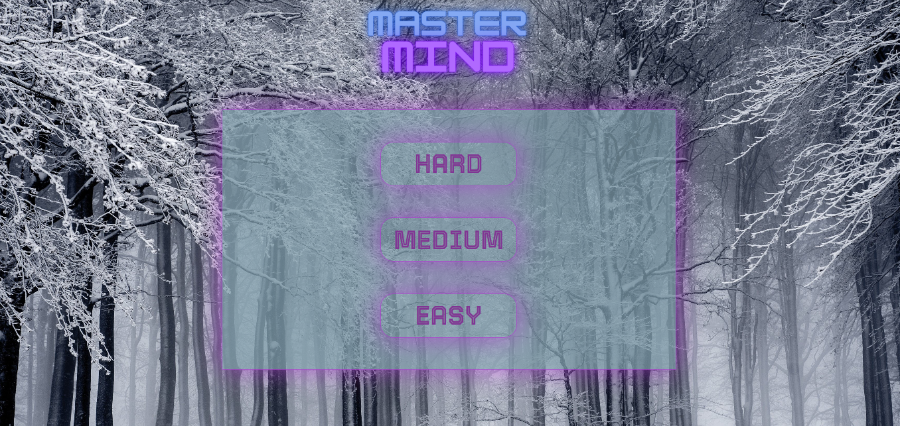
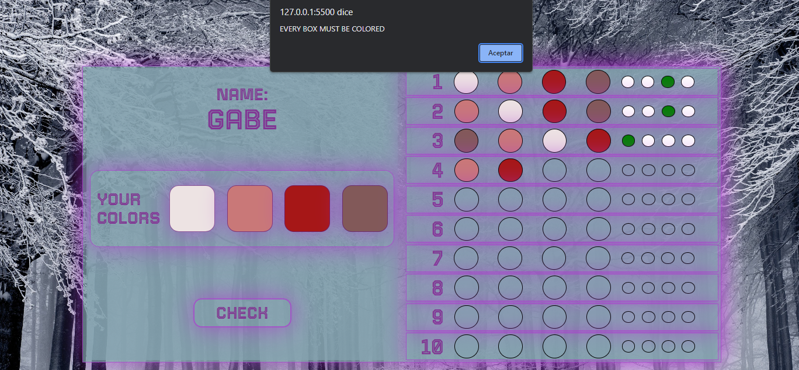
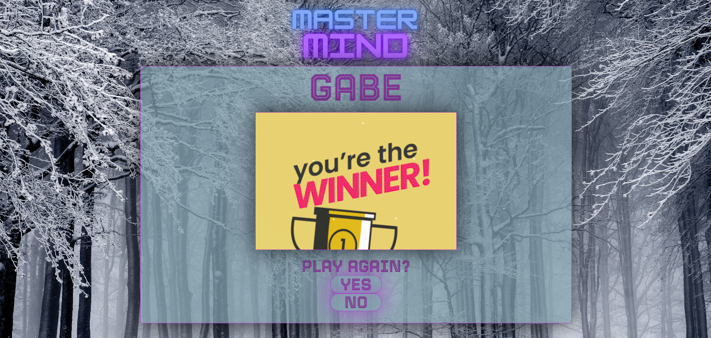
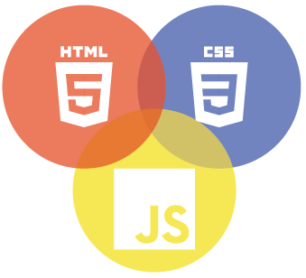

<h1 align="center">MASTERMIND</h1>
<h3 align="center"> By Gabriel Escudillo</h3>

<a href="https://gabrielescudillo.github.io/index.html">https://gabrielescudillo.github.io/MastermindGB/</a>

## Contenido

- [Introducción](#introducción)
- [Características](#📋-características)
- [Problemas y posibles soluciones ](#problemas-y-posibles-soluciones)
- [Tecnologías](#tecnologías-utilizadas)
- [Autor](#📝-autor)
- [Licencia](#⚖️-licencia)

## Introducción

Mastermind

**Juego MasterMind** Es un juego de mesa para, el objetivo es que el jugador descifre una combinación secreta de colores tratando de hacerlo con la menor cantidad de intentos.

## 📋 Características

Al iniciar la página, lo primero que nos encontraremos será la pantalla de presentación del juego, donde tendremos la opción de iniciarlo o de leer las instrucciones.

Al entrar en la pestaña "about" serán visibles las instrucciones de juego y nos permitira volver a la pantalla de inicio o avanzar con el juego.

 

Si hacemos click en "play" nos llevará a la pantalla donde se deberá establecer el nombre, es obligatorio para poder avanzar.

 

En la siguiente ventana, tendremos que elegir el nivel de dificultad, de momento solo estará disponible el nivel "easy".

 

Una vez se ha definido el nombre, debemos seleccionar 4 colores diferentes, si no se eligen los 4 colores o si son iguales no nos permitira avanzar.

En el lado izquierdo se mostrara el nombre y los colores que se han seleccionado previamente así como el boton "check" para verificar si la combinación de colores es correcta o no. 

En el lado derecho veremos reflejada la combinación de nuestro intento, el color verde indicara que el color esta en la ubicación correcta y el color blanco lo contrario. 

 

Si la combinación es correcta, avanzará a la pantalla ganadora y nos preguntará si queremos jugar nuevamente o no, en caso de que hagamos click en "yes" nos pedirá que seleccionemos 4 nuevos colores.

 

Si en el decimo intento no hemos conseguido la combinación correcta de colores, nos llevará a la pantalla de perdedor, preguntandonos si queremos intentarlo nuevamente o no.

 

  
## Problemas y posibles soluciones 

En este proyecto me hubiese gustado poder crear los tres diferentes niveles pero debido a aún tengo que conocer un poco más a fondo JavaScript para poder hacerlo.

También hubiese sido ideal añadir el boton "remove" en la pestaña del juego para que en caso de que el jugador seleccione un color equivocado pueda corregirlo antes de proceder con la validación.

Voy a continuar trabajando en las mejoras de este proyecto para perfeccionarlo.

## Tecnologías Utilizadas

 
## 📝 Autor

- **Nombre**: Gabriel Escudillo
- **Email**: gabrielescudillo@gmail.com
- **Linkedin**: [LinkedIn](https://www.linkedin.com/in/gabriel-escudillo-b8b436134/)

## ⚖️ Licencia

Este proyecto está bajo la Licencia MIT. Consulta el archivo `LICENSE` para obtener más información.
